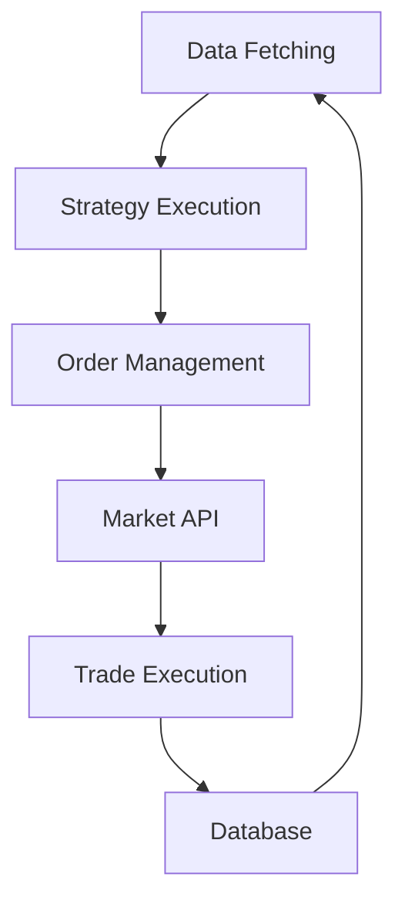

# TradingBot

## Overview

The `TradingBot` project is an automated trading system designed to execute trading strategies in financial markets. It leverages Pine Script for strategy definition and includes components for data management, order execution, and configuration.

## Design Rationale

1. **Modularity**: The project is designed with modularity in mind, allowing different components (e.g., data fetching, strategy execution, order management) to be developed and tested independently.
2. **Scalability**: The architecture supports scaling, enabling the addition of new strategies and markets with minimal changes to the core system.
3. **Security**: Sensitive information such as API keys and database credentials are managed securely, ensuring that they are not exposed in the codebase.
4. **Maintainability**: The code is structured to be easily maintainable, with clear separation of concerns and comprehensive documentation.

## Project Structure

- `strategies/`: Contains Pine Script files defining various trading strategies.
- `data/`: Manages data fetching and storage.
- `orders/`: Handles order execution and management.
- `config/`: Configuration files and environment settings.
- `tests/`: Unit and integration tests for the project.

## How It Works

### Architecture


1. **Data Fetching**: Collects market data from various sources and stores it in the database.
2. **Strategy Execution**: Runs trading strategies defined in Pine Script using the fetched data.
3. **Order Management**: Manages the creation, modification, and cancellation of orders based on strategy signals.
4. **Market API**: Interfaces with financial markets to execute trades.
5. **Trade Execution**: Executes trades and updates the database with trade details.

### Setup

1. Clone the repository:
    ```bash
    git clone https://github.com/yourusername/TradingBot.git
    cd TradingBot
    ```

2. Install dependencies:
    ```bash
    pip install -r requirements.txt
    ```

3. Configure environment variables:
    - Create a `.env` file in the `config/` directory with your API keys and other settings.

4. Run the bot:
    ```bash
    python main.py
    ```

### Contributing

1. Fork the repository.
2. Create a new branch (`git checkout -b feature-branch`).
3. Make your changes.
4. Commit your changes (`git commit -am 'Add new feature'`).
5. Push to the branch (`git push origin feature-branch`).
6. Create a new Pull Request.

### License

This project is licensed under the MIT License - see the [LICENSE](LICENSE) file for details.
